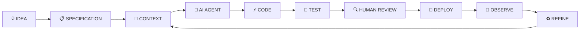
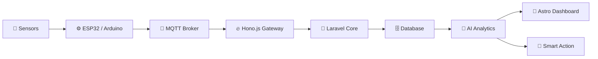

<div align="center">


<br />


</div>

---

## `> ACCESS_GRANTED // ENGINEER_PROFILE`

```yaml
identity:
  name: "Kumajung MaShiMa"
  alias: "Didy"
  role: "AI-Native Full-Stack Engineer"
  laboratory: "Toktolab"
  operating_mode: "Cyberpunk Future Builder"

specializations:
  - AI-Powered Web Applications
  - Full-Stack Software Engineering
  - Backend & API Architecture
  - Agentic AI Systems
  - IoT & Smart Platforms
  - DevOps & Infrastructure
  - Legacy System Modernization
  - Rapid MVP Engineering
  - Vibe Coding
  - Harness Loop Engineering

system_status:
  creativity: "MAXIMUM"
  engineering: "PRODUCTION READY"
  ai_core: "ACTIVE"
  automation: "ENABLED"
  human_control: true
```

---

<div align="center">

## `CYBERPUNK ENGINEERING MATRIX`


</div>

---

## `> SYSTEM_MANIFEST`

I engineer **scalable web platforms**, **AI-powered applications**, **high-performance APIs**, and **smart connected systems** using modern architecture and controlled AI-assisted development.

My systems combine:

```text
┌──────────────────────────────────────────────────────────────┐
│                                                              │
│  LARAVEL     ASTRO       HONO.JS       NODE.JS              │
│  PHP         TYPESCRIPT  MYSQL         POSTGRESQL            │
│  AI / LLM    RAG         AGENTIC AI    AUTOMATION            │
│  DOCKER      LINUX       NGINX         IoT / MQTT            │
│                                                              │
└──────────────────────────────────────────────────────────────┘
```

> Building fast is easy.
> Building fast, secure, scalable and maintainable systems is engineering.

---

## `> LIQUID_GLASS_ARCHITECTURE`

```mermaid
flowchart LR
    USER["👤 USER ACCESS"]

    subgraph GLASS["🌌 LIQUID GLASS INTERFACE"]
        ASTRO["⚡ Astro"]
        REACT["⚛️ React"]
        UI["💎 Bootstrap / Tailwind"]
        DATAUI["📊 Chart.js"]
    end

    subgraph GATEWAY["🔮 API GATEWAY"]
        HONO["🔥 Hono.js"]
        NODE["🟢 Node.js"]
        REST["🔗 REST API"]
    end

    subgraph CORE["🧠 APPLICATION CORE"]
        LARAVEL["🔴 Laravel"]
        PHP["🐘 PHP"]
        AUTH["🛡️ Sanctum / RBAC"]
        JOBS["⚙️ Jobs / Automation"]
    end

    subgraph AI["🤖 AI INTELLIGENCE CORE"]
        LLM["Large Language Model"]
        RAG["RAG System"]
        AGENT["Agentic AI"]
        MCP["MCP / Tool Calling"]
    end

    subgraph DATA["🗄️ DATA GRID"]
        MYSQL["MySQL"]
        POSTGRES["PostgreSQL"]
        REDIS["Redis"]
        STORAGE["Object / File Storage"]
    end

    subgraph EDGE["📡 IoT & EDGE NETWORK"]
        SENSOR["Sensors"]
        ESP["ESP32 / Arduino"]
        MQTT["MQTT"]
        DEVICE["Smart Devices"]
    end

    USER --> GLASS
    GLASS --> GATEWAY
    GATEWAY --> CORE
    CORE --> AI
    CORE --> DATA
    EDGE --> GATEWAY
    AI --> GLASS
    AI --> EDGE
```



---

## `> ELITE_STACK // FRONTEND`

<p align="center">


</p>

```text
ASTRO ISLAND ARCHITECTURE
REACT COMPONENT SYSTEMS
TYPESCRIPT APPLICATION DESIGN
RESPONSIVE UI / MOBILE-FIRST
LIQUID GLASS INTERFACES
CYBERPUNK DESIGN SYSTEMS
SEO / SSR / SSG
INTERACTIVE DASHBOARDS
ACCESSIBLE USER EXPERIENCE
PWA & OFFLINE-FIRST CONCEPTS
```

---

## `> ELITE_STACK // BACKEND`

<p align="center">


</p>

### Backend Capabilities

```text
[01] Laravel REST API Architecture
[02] Hono.js Lightweight API Services
[03] Node.js Backend Development
[04] Laravel Sanctum Authentication
[05] Role-Based Access Control
[06] Clean Architecture
[07] Three-Tier Architecture
[08] API-First System Design
[09] Background Jobs and Queues
[10] Event-Driven Workflows
[11] Webhook Integration
[12] External API Integration
[13] File and Document Management
[14] Audit Logs and Traceability
[15] Legacy PHP Modernization
```

---

## `> HONO.JS // EDGE_ENGINE`

```typescript
import { Hono } from "hono";
import { logger } from "hono/logger";
import { cors } from "hono/cors";

const app = new Hono();

app.use("*", logger());
app.use("*", cors());

app.get("/system/status", (context) => {
  return context.json({
    engineer: "Dee",
    laboratory: "Toktolab",
    runtime: "Hono.js",
    aiCore: "ACTIVE",
    liquidGlass: "ENABLED",
    status: "CYBER SYSTEM ONLINE",
  });
});

export default app;
```

```text
HONO.JS MODE
├── Lightweight APIs
├── Edge-ready Services
├── TypeScript-first Development
├── Middleware Architecture
├── Serverless Deployment
└── High-performance Routing
```

---

## `> NODE.JS // SERVICE_GRID`

```typescript
interface CyberService {
  service: string;
  runtime: string;
  status: "ONLINE" | "OFFLINE";
  intelligence: boolean;
}

const service: CyberService = {
  service: "Toktolab AI Gateway",
  runtime: "Node.js",
  status: "ONLINE",
  intelligence: true,
};

console.table(service);
```

Node.js is used for:

* real-time services
* API gateways
* automation scripts
* WebSocket systems
* event-driven applications
* microservices
* AI tool integration
* background workers
* data synchronization
* IoT communication

---

## `> AI_NATIVE_CORE`

<div align="center">


</div>

### AI Engineering Skills

```text
AI-NATIVE APPLICATION DEVELOPMENT
LARGE LANGUAGE MODEL INTEGRATION
RETRIEVAL-AUGMENTED GENERATION
AGENTIC AI SYSTEM DESIGN
PROMPT ENGINEERING
CONTEXT ENGINEERING
MODEL CONTEXT PROTOCOL
FUNCTION CALLING
TOOL CALLING
STRUCTURED OUTPUT
MULTI-AGENT WORKFLOWS
AI CHATBOT DEVELOPMENT
THAI LANGUAGE MODEL INTEGRATION
AI SEARCH AND RECOMMENDATION
INTELLIGENT DOCUMENT PROCESSING
SENTIMENT ANALYSIS
WORKFLOW AUTOMATION
AI-ASSISTED TESTING
AI-ASSISTED DEBUGGING
AI-ASSISTED REFACTORING
```

---

## `> VIBE_CODING_PROTOCOL`



> Vibe Coding is not random code generation.
> It is controlled acceleration through context, architecture, testing and engineering judgment.

---

## `> HARNESS_LOOP_ENGINEERING`

```yaml
harness_loop:
  mission:
    - Define the goal
    - Control the context
    - Establish architecture constraints
    - Generate implementation
    - Execute validation
    - Refactor continuously

  engineering_harness:
    - Requirements
    - Coding Standards
    - Architecture Rules
    - Automated Tests
    - Static Analysis
    - Security Validation
    - Human Review
    - Deployment Checks

  output:
    - Tested Code
    - Traceable Decisions
    - Technical Documentation
    - Deployment Artifacts
    - Production-Ready Systems
```

```text
┌─────────────────────────────────────────────────────────┐
│                                                         │
│  AI WITHOUT HARNESS                                     │
│  = FAST + UNCONTROLLED                                   │
│                                                         │
│  AI WITH HARNESS                                        │
│  = FAST + TESTABLE + TRACEABLE                           │
│                                                         │
│  ENGINEER IN CONTROL                                    │
│  = PRODUCTION-READY SYSTEM                              │
│                                                         │
└─────────────────────────────────────────────────────────┘
```

---

## `> DATABASE_GRID`

<p align="center">


</p>

```text
RELATIONAL DATABASE DESIGN
ENTITY RELATIONSHIP MODELING
DATABASE NORMALIZATION
INDEXING STRATEGY
QUERY OPTIMIZATION
TRANSACTION MANAGEMENT
AUDIT TRAILS
DATA MIGRATION
BACKUP AND RECOVERY
CACHE STRATEGY
REAL-TIME DATA PIPELINES
DASHBOARD DATA MODELING
DATA QUALITY MANAGEMENT
```

---

## `> IoT_EDGE_NETWORK`



### Smart System Capabilities

```text
SENSOR DATA COLLECTION
MQTT COMMUNICATION
REAL-TIME DEVICE MONITORING
EDGE-TO-CLOUD INTEGRATION
WEB-CONTROLLED DEVICES
SMART DASHBOARDS
PREDICTIVE MONITORING
ENVIRONMENTAL SENSING
SMART BUILDING SYSTEMS
SMART CAMPUS SYSTEMS
AI + IoT INTEGRATION
```

---

## `> DEVOPS_COMMAND_CENTER`

<p align="center">


</p>

```text
LINUX SERVER ADMINISTRATION
DOCKER CONTAINERIZATION
APACHE / NGINX CONFIGURATION
CI/CD PIPELINES
GITHUB ACTIONS
REVERSE PROXY
SSL / DOMAIN MANAGEMENT
SHARED HOSTING DEPLOYMENT
VPS DEPLOYMENT
SERVER MONITORING
LOG MANAGEMENT
ENVIRONMENT CONFIGURATION
SECRET MANAGEMENT
NAS INTEGRATION
PERFORMANCE OPTIMIZATION
```

---

## `> SECURITY_FIREWALL`

```text
OWASP TOP 10
SECURE CODING PRACTICES
AUTHENTICATION AND AUTHORIZATION
ROLE-BASED ACCESS CONTROL
API TOKEN SECURITY
CSRF PROTECTION
XSS PREVENTION
SQL INJECTION PREVENTION
INPUT VALIDATION
RATE LIMITING
SECURITY HEADERS
PASSWORD HASHING
AUDIT LOGGING
PRINCIPLE OF LEAST PRIVILEGE
ENVIRONMENT SECRET PROTECTION
```

---

## `> SOFTWARE_ENGINEERING_PROTOCOL`

| Domain        | Capabilities                                       |
| ------------- | -------------------------------------------------- |
| Requirements  | SRS, Use Cases, User Stories, Acceptance Criteria  |
| Architecture  | Clean Architecture, MVC, Three-Tier, API-First     |
| Modeling      | UML, BPMN, ER Diagram, Activity Diagram            |
| Development   | Agile, Iterative Development, Rapid MVP            |
| Testing       | Unit, Integration, API, UAT, Performance           |
| Quality       | Code Review, Static Analysis, Traceability         |
| Documentation | SDD, Test Plan, User Manual, Deployment Guide      |
| Research      | Software Engineering Research and Evaluation       |
| Improvement   | Refactoring, BPR, Automation, Process Optimization |

---

## `> TOKTOLAB_EXPERIMENTAL_CORE`

<div align="center">

### `TOKTOLAB`

**Technology × Innovation × Experiment × Intelligence**


</div>

```yaml
toktolab:
  research_domains:
    - AI-Powered Web Applications
    - Agentic Software Engineering
    - Harness-Driven Development
    - Intelligent Automation
    - Digital Transformation
    - IoT and Smart Systems
    - Data Intelligence
    - Human-AI Collaboration

  engineering_stack:
    frontend:
      - Astro
      - React
      - TypeScript
      - Liquid Glass UI

    backend:
      - Laravel
      - PHP
      - Hono.js
      - Node.js

    intelligence:
      - LLM
      - RAG
      - AI Agents
      - MCP
      - Thai LLM

    infrastructure:
      - Docker
      - Linux
      - Nginx
      - Apache
      - NAS
      - Cloud
```

---

## `> CURRENT_MISSIONS`

```text
[ACTIVE] AI-POWERED WEB APPLICATIONS
[ACTIVE] LARAVEL API ARCHITECTURE
[ACTIVE] ASTRO HIGH-PERFORMANCE FRONTEND
[ACTIVE] HONO.JS EDGE SERVICES
[ACTIVE] NODE.JS AUTOMATION SYSTEMS
[ACTIVE] AI CHATBOT AND RAG
[ACTIVE] LIQUID GLASS USER INTERFACES
[ACTIVE] IoT MONITORING PLATFORMS
[ACTIVE] LEGACY PHP MODERNIZATION
[ACTIVE] HARNESS LOOP ENGINEERING
[ACTIVE] RAPID MVP DEVELOPMENT
[ACTIVE] THAI LLM INTEGRATION
```

---

## `> ENGINEERING_POWER_MATRIX`

| System Layer   | Technology                                      |
| -------------- | ----------------------------------------------- |
| Interface      | Astro, React, Bootstrap, Tailwind, Liquid Glass |
| Runtime        | PHP, Node.js, JavaScript, TypeScript            |
| Backend        | Laravel, Hono.js, REST API                      |
| Intelligence   | LLM, RAG, AI Agents, MCP                        |
| Database       | MySQL, PostgreSQL, Redis                        |
| Infrastructure | Linux, Docker, Apache, Nginx                    |
| IoT            | ESP32, Arduino, Raspberry Pi, MQTT              |
| Security       | Sanctum, RBAC, OWASP, API Security              |
| Automation     | GitHub Actions, AI Agents, Workflow Engines     |
| Laboratory     | Toktolab Innovation Ecosystem                   |

---

## `> ENGINEER_OPERATING_SYSTEM`

```typescript
type SystemStatus = "ONLINE" | "OFFLINE" | "GOD_MODE";

interface FutureEngineer {
  identity: string;
  laboratory: string;
  stack: string[];
  capabilities: string[];
  aiNative: boolean;
  humanInControl: boolean;
  status: SystemStatus;
}

const dee: FutureEngineer = {
  identity: "AI-Native Full-Stack Engineer",

  laboratory: "Toktolab",

  stack: [
    "Laravel",
    "Astro",
    "Hono.js",
    "Node.js",
    "TypeScript",
    "MySQL",
    "Docker",
    "IoT",
  ],

  capabilities: [
    "Architecture",
    "Automation",
    "AI Integration",
    "Harness Loop Engineering",
    "Vibe Coding",
    "Legacy Modernization",
    "Future System Design",
  ],

  aiNative: true,
  humanInControl: true,
  status: "GOD_MODE",
};

function initializeEngineer(engineer: FutureEngineer): string {
  if (!engineer.humanInControl) {
    return "WARNING :: HUMAN REVIEW REQUIRED";
  }

  return `
    SYSTEM      :: ${engineer.status}
    AI CORE     :: ${engineer.aiNative ? "ACTIVE" : "DISABLED"}
    LABORATORY  :: ${engineer.laboratory}
    ENGINEER    :: READY TO BUILD THE FUTURE
  `;
}

console.log(initializeEngineer(dee));
```

---

## `> CYBER_ACTIVITY_GRAPH`

<div align="center">


</div>

---

## `> GITHUB_NEURAL_STATS`

<div align="center">


</div>

<div align="center">


</div>

---

## `> CONTRIBUTION_SNAKE_PROTOCOL`

<div align="center">


</div>

---

## `> FINAL_TRANSMISSION`

```text
╔══════════════════════════════════════════════════════════════╗
║                                                              ║
║               TOKTOLAB CYBER ENGINEERING CORE                ║
║                                                              ║
║      THINK  •  ARCHITECT  •  BUILD  •  TEST  •  EVOLVE      ║
║                                                              ║
║           HUMAN CREATIVITY × AI ACCELERATION                 ║
║                                                              ║
║           FAST IS GOOD. CONTROLLED FAST IS ELITE.            ║
║                                                              ║
╚══════════════════════════════════════════════════════════════╝
```

<div align="center">


<br />


<br /><br />


</div>
